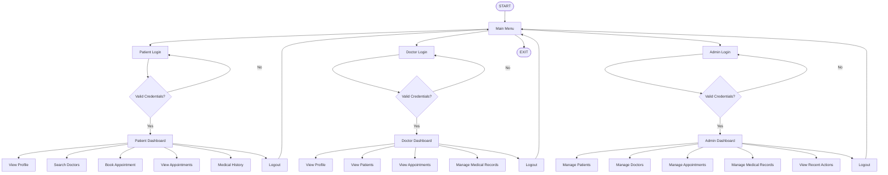

PATIENT MANAGEMENT SYSTEM - JAVA + DSA ONLY
===========================================

Console application. No GUI. No other programming language.

MAIN FEATURES
1. Separate Patient Login
2. Separate Doctor Login
3. Patient self-registration with name, age, gender, contact, username and password
4. Doctor self-registration with name, age, gender, specialization, availability, username and password
5. Admin login
6. Admin can VIEW, EDIT and DELETE every patient detail
7. Admin can VIEW, EDIT and DELETE every doctor detail
8. Admin can VIEW, EDIT and DELETE appointments
9. Admin can VIEW, EDIT and DELETE medical records
10. Patients and doctors have their own accounts
11. DSA is actually used

DSA USED
- ArrayList: patients, doctors, appointments
- LinkedList: medical records
- HashMap: ID and username account lookup
- Queue: normal pending appointments
- PriorityQueue: emergency pending appointments
- Stack: recent actions
- Merge Sort: patient sorting by name
- HashSet: avoid duplicate patient display for doctor

## COMPILATION 
#Compile from project root

javac -d out src\model\*.java src\dsa\*.java src\service\*.java src\Main.java

#RUN

java -cp out Main

## SAMPLE ACCOUNTS

Patient: sudheer / sudheer123

Patient: anjali / anjali123

Doctor: arjun / arjun123

Doctor: priya / priya123

Admin: admin / admin123

IMPORTANT
Data is stored in Java memory, so it resets when the program closes.

## PROGRAM FLOW

                  EXIT

